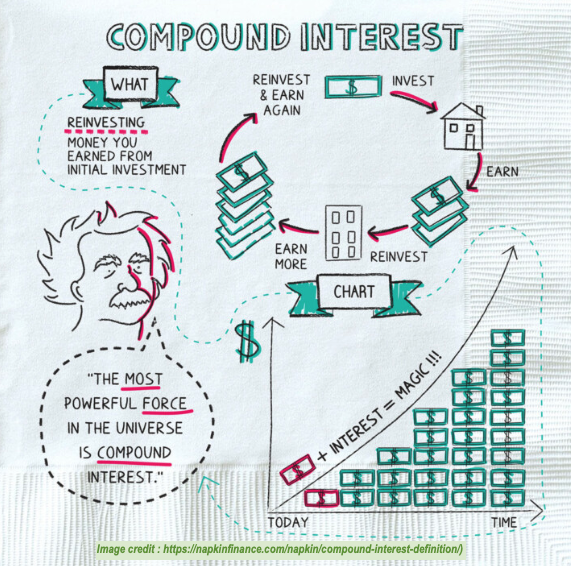

#### Albert Einstein most certainly did NOT say "Compound Interest is the most powerful force in the Universe". Still, it may be true ...

### 📖 Interactive Lesson Worksheet
Below is the full worksheet for our upcoming lesson. You can view it directly on this page, or download it using the link below the viewer.

  <iframe src="{{ site.baseurl }}/magic_of_exponentials.pdf#view=FitH&zoom=117&navpanes=0" width="100%" height="900px" style="border: 2px solid #ddd; border-radius: 4px; max-width: 100%; width: 100%;">
    This browser does not support embedding PDFs. Please download the PDF to view it.
   iframe>
div>

  📥 <a href="{{ site.baseurl }}/magic_of_exponentials.pdf" download style="font-weight: bold; text-decoration: underline;">Click here to download the PDF Worksheet</a>

