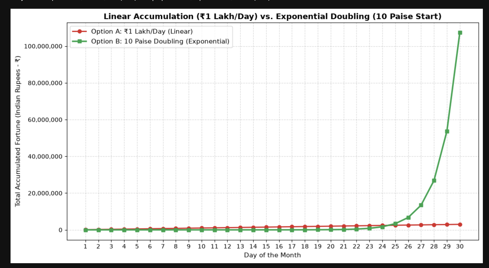

# Magic of Exponentials  
  
## 🌾 Module 1: The ancient Indian story of the Chaturanga  
##  🌾 1.1 The Legend of Chaturanga  
### In ancient India, the inventor of chess (Chaturanga) presented his game to the ruling king. As a reward, the inventor requested a seemingly trivial prize:  
* **1 grain of rice** on the first square of the board.  
* **2 grains** on the second square, **4 grains** on the third, **8 grains** on the fourth, and so on.  
* The payout must double continuously for each of the **64 squares** on the board.  
* The king immediately accepted, how much rice did the king owe to the inventer?  Can you guess at the answer? This picture should give you a clue!

### In this session we will calculate this from first principles which will show the real nature of Exponential functions following the 10 steps below:

**1. First let us draw a 4x4 chess board with 16 squares:**

| sq #| sq #| sq # |sq # |
| :---: | :---: | :---: | :---: |
| **1** | **2** | **3** | **4** |
| **5** | **6** | **7** | **8** |
| **??** | **??** | **??** | **??** |
| **??** | **??** | **??** | **??** |

...

**2. Now, let us put the number of rice in each square:**

|rice qty|rice qty|rice qty|rice qty|
| :---: | :---: | :---: | :---: |
| **1** | **2** | **4** | **8** |
| **16** | **??** | **??** | **??** |
| **??** | **??** | **??** | **??** |
| **??** | **??** | **??** | **??** |

...

**3. The number of rice kernels in any given (single) square can be modeled or calculated. To do that we find an equation or formula to directly compute it. We will use exponential numbers (powers of 2) for this :** 

 > *note that ${2}^0 = 1 $ or $ {(any\ number)}^0 = 1 $* Also note that $2^1 = 2$ or $ {(any\ number)}^1 = {(same\ number)}$

| | | | |
| :---: | :---: | :---: | :---: |
| $ 2^0 $ | $ 2^1 $ | $ 2^2 $ | $ 2^3 $ |
| $ 2^4 $ | **??** | **??** | **??** |
| **??** | **??** | **??** | **??** |
| **??** | **??** | **??** | $ 2^{15} $ | 
    
 > * Why are we missing $2^{16}$ above?  
 > * Can you see how you can, for instance, calculate the number of rice kernels in the 7th square or the 16th square? (First figure out what exponent of $2$ that you will need and use your calculator to find it) 
 
 Let us write this as a equation or formula.  A *variable* on the *LHS* (left-hand-side of the equation) $C_{16}$ and setting it equal to the number of rice kernels on the *RHS* (right-hand-side of equation). This is what we commonly do in **Algebra**.

> $ C_{7} = 2^{6} $ where $C_{7}$ is the count of rice kernels in the $7$ th square

We can also make this formula to apply to all numbers generally writing it this way!  Also note how this equation have been given a letter label so that we can easily refer to it later.

> $ \textcircled{A}\; C_{n} = 2^{n-1} $ where $C_{n}$ is the count of rice kernels in the $n$ th square

 However, to solve the Chaturanga problem, we will need the Sum of the rice kernels in all of the squares!

**4. To see how we can model (calculate) that, let us create a Series with 16 terms for 16 squares and sum all of the terms (sum of all the grains in all 16 squares):**

Note that we are giving the Series Sum a single *name* or *variable* on the *LHS* (left-hand-side of the equation) $S_{16}$ and setting it equal to the actual sum on the *RHS* (right-hand-side of equation). 
    
> $ S_{16} = 1\ +\ 2\ +\ 4\ +\ 8\ +\ 16\ +\ 32\ +\ 64\ +\ ...\ \ +\ 32,768 $

**5. You can also write the 16-term (4x4) series using exponentials as (hints: $2^0 = 1$ and $2^1 = 2$):**
    
 > $ S_{16} =\ 2^0\ +\ 2^1\ +\ 2^2\ +\ 2^3\ +\ 2^4\ +\ ...\ \ +\ 2^{14}\ +\ 2^{15} $ why are we missing the $2^{16}$ term?

**6. Can you write out the full Series for a 8x8 square chessboard in powers of 2? (you will need 64 terms):**

Note that "$\dots$" is a shorcut for the missing multiple terms without having to write them all out! Also note how this equation have been given a number label $\textcircled{1}$ so that we can easily refer to it later.

 > $\textcircled{1}\;S_{64} =\ 2^0\ +\ 2^1\ +\ 2^2\ +\ 2^3\ +\ 2^4\ +\ ...\ \ +\ 2^{62}\ +\ 2^{63}$

**7. Multiply equation $ \textcircled{1}$ above by $2$ on both sides (*LHS & RHS*) of the $=$ sign:**

Note that since the RHS has multiple terms which are summed, we have to multiply each term in the sum by $2$

 > $ \textcircled{2}\;2*S_{64} =\ 2*2^0\ +\ 2*2^1\ +\ 2*2^2\ +\ 2*2^3\ +\ 2*2^4\ +\ ...\ \ +\ 2*2^{62}\ +\ 2*2^{63}$
    
**8. Simplify equation $ \textcircled{2}$ above to get (hints: $2*2^0 = 2^{1+0} = 2^1$ and $2*2^3 = 2^{1+3} = 2^4$):**

 > $ \textcircled{3}\;2*S_{64} =\ 2^1\ +\ 2^2\ +\ 2^3\ +\ 2^4\ +\ 2^5\ +\ ...\ \ +\ 2^{63}\ +\ 2^{64} $

**9. Subract equation $ \textcircled{1}$ from equation $\textcircled{3}$ to get $\textcircled{3}-\textcircled{1}$ as follows (shifted terms in equation $\textcircled{3}$ for lining up):** 

Note that we are now manipulating entire equations or formulas. This is advanced maths!

> | | | | | | | | | | | |
> | :---: | :---: | :---: | :---: | :---: | :---: | :---: | :---: | :---: | :---: | :---: |
> | $\textcircled{3}\,2*S_{64} \,=$ | *(shift)*$+$ | $2^1 \,+$ | $2^2 +$ | $2^3 +$ | $2^4 +$ | $2^5+ $ | $... $ | $2^{63}+ $ | $2^{64} $ | |
> | $\textcircled{1}\,S_{64} \,=$ | $2^0 \,+$ | $2^1 \,+$ | $2^2 +$ | $2^3 +$ | $2^4 +$ | $... $ | $2^{62}+ $ | $2^{63} $ | |
> |$\textcircled{4}\,S_{64}=\;\;\;\;\;\;\;$ | $-1 +$ |$0+$|$0+$ |$0+$ |$0+$ |$0+$ |$0+$ |$0+$ | $2^{64} $|
 
**10. Simplify equation $ \textcircled{4}$ above to get $ \textcircled{5}$ which represents the number of rice kernels in square 64 of the chess board.**

 > $ \textcircled{5}\;S_{64} = 2^{64} - 1 $  This is our formula for calculating the total amount of rice in the entire board!

 > What if we had smaller (3x3) or bigger (9x9) chess boards?
 > Can we write a general formula for for chess boards with (nxn) squares?  Yes we can!  Can you guess it?

  > $ \textcircled{B}\;S_{n} = 2^{n} - 1 $  This is our formula for calculating the total sum amount of rice in any $ n \times n $ board!
 
  > Compare this with $\textcircled{A}\;C_{n} = 2^{n-1} $ where $C_{n}$ is the count of rice kernels in the $n$ th square. There is a very subtle but important difference, can you spot it? This is the nature of all Mathematics!

### Computing the answer for the Chaturanga (8x8=64) sum of rice kernels in your calculator will give you a **HUMUNGOUS** number - 18 followed by another 18 decimals or 18.5 quntillion rice kernels!! 

> Note that we can use formula $ \textcircled{B}\;S_{n} = 2^{n} - 1 $ where $n = 64$

 **$ Total\ Amount\ of\ Rice=(2^{64}-1)=\mathbf{18,446,744,073,709,551,615}\text{\ kernels}$**

### Just how much rice is that when compared to the entire annual rice production of India? How many years will it take to produce that much rice?

**Here is some pertinent information for you to calculate this**

    1. Average Weight of a Single Rice Grain ≈ 0.025 grams
    2. Indian Annual Rice Production = 150 million metric tonnes
    3. There are 1000 grams in a kg
    4. There are 1000 kg in a metric tonne

### Let us work on te above together in class ...

## 🌾 1.2  Homework Question/Problem in Finance

**Problem:** Would you rather receive **1 Lakh rupees (₹100,000) every day for a whole month**, or **10 paise (₹0.10) that doubles each day for a month?** How much total money will you have on the 30th day?
* **Hint for 1st option**: The answer can be calculated very easily: **1 Lakh rupees (₹100,000) every day** for 30 days - simply a straight multiplcation will do!
* **Hints for 2nd option**: 
    - Convert 10 paise to  0.1 rupees and do exactly the same process we did in calculating # of rice grains. 
    - Use the same formula ($ \textcircled{B}\;S_{n} = 2^{n} -1$ will work, except you have to substitute $n$ with a number.
* **Examine** a comparison plot of the 2 options below and **write** down your thoughts about it.
* 
* **We will discuss all of this the upcoming weeks**!

